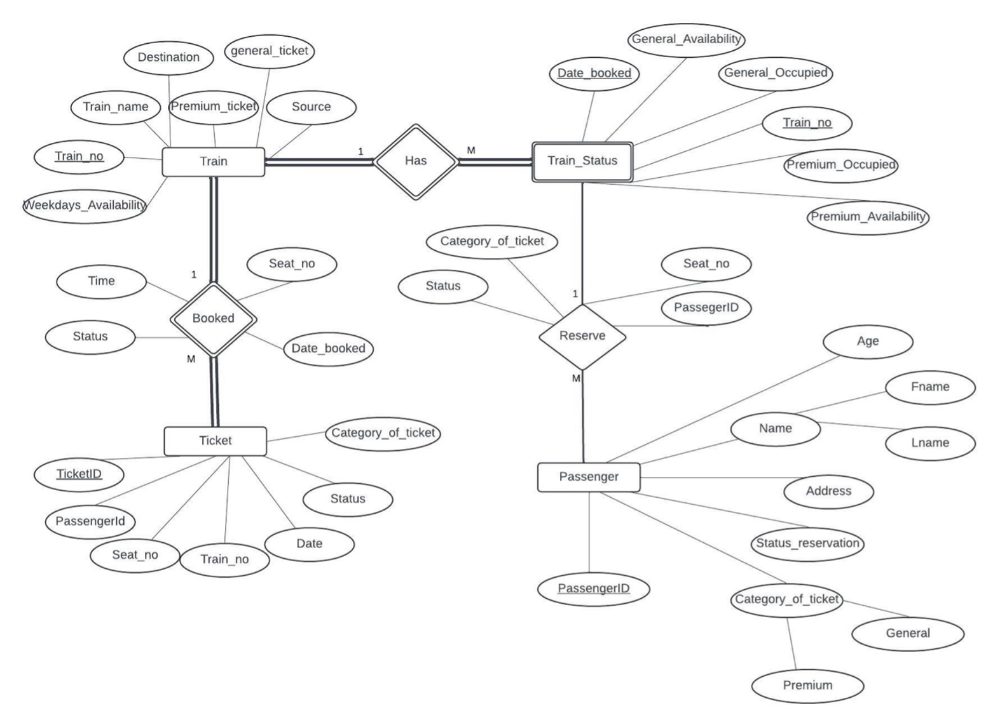
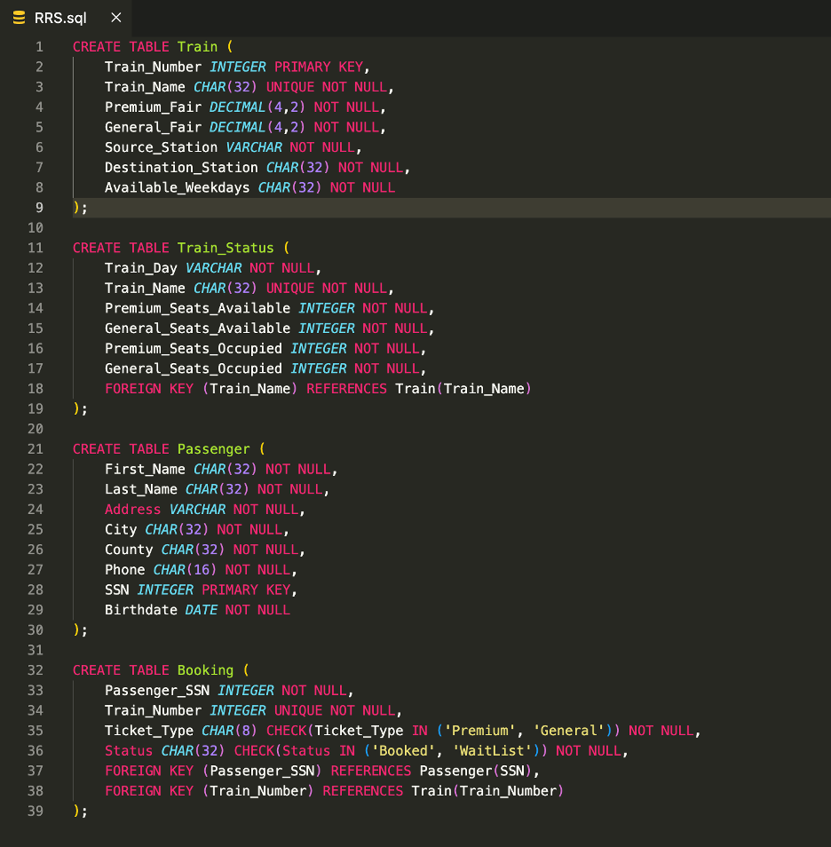
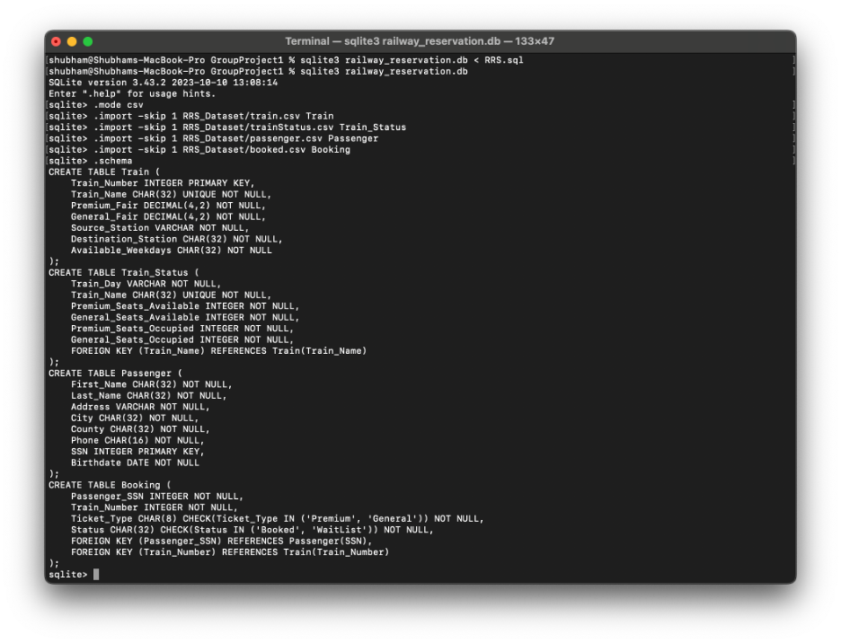
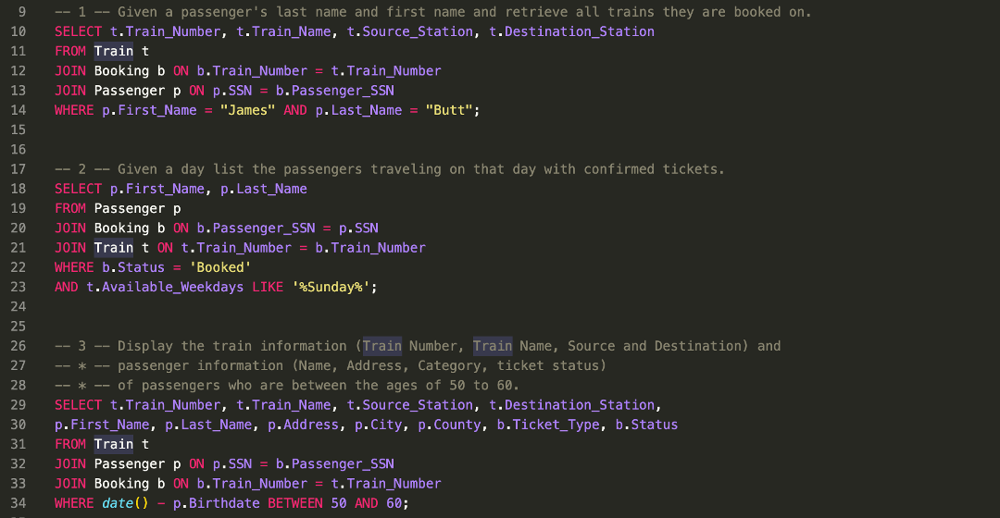

# Railway Reservation System (CSE 3330: Project 1)

## Project Overview
In this project for class CSE-3330 (Database Systems & File Structures), I have developed a Railway Reservation System database implementing a complete database solution from schema design to query execution.

## Tools Used
- **SQLite3 Command Line Interface**: Used to execute import statements and queries
- **VSCode**: Used to write the SQL code (`RRS.sql` file)

## Entity Relationship (ER) Diagram
First, I Designed the database structure as shown in the ER diagram below:

## Database Implementation
Then I created four interconnected tables (Train, Train_Status, Passenger, Booking) with appropriate constraints as shown:

## Data Loading Process
- I modified the .csv files to address formatting issues:
  - Adjusted "Available on Weekdays" attribute in `train.csv`
  - Converted birthdates from MM/DD/YYYY to YYYY-MM-DD in `passenger.csv`
- Then I imported data using SQLite's `.import` command:

## SQL Queries
I Implemented various SELECT statements for:
- Passenger booking lookups
- Train availability checks
- Age-based filtering
- Waitlist management

## Project Files
- `RRS.sql`: Contains `CREATE TABLE` statements with constraints
- `demo.sql`: Contains `.import` commands and `SELECT` queries
- `RRS_Dataset/`: Is the directory containing `.csv` data files

## Contact
If you have any questions or feedback related to this project, or if you just want to connect, feel free to reach out to me at:

- **Email**: [shubhamcweb@gmail.com](mailto:shubhamcweb@gmail.com)
- **LinkedIn**: [linkedin.com/in/shubhamcweb](https://linkedin.com/in/shubhamcweb)

#### Thanks for visiting my project!
